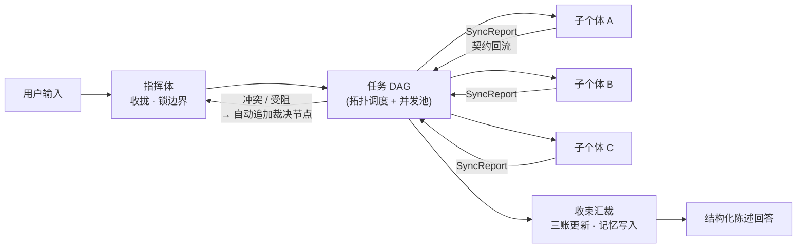

<div align="center">

```text
███████╗ ██╗  ██╗ ███╗   ███╗  █████╗   ██████╗ ██╗  ██╗ ██╗ ███╗   ██╗  █████╗
██╔════╝ ╚██╗██╔╝ ████╗ ████║ ██╔══██╗ ██╔════╝ ██║  ██║ ██║ ████╗  ██║ ██╔══██╗
█████╗    ╚███╔╝  ██╔████╔██║ ███████║ ██║      ███████║ ██║ ██╔██╗ ██║ ███████║
██╔══╝    ██╔██╗  ██║╚██╔╝██║ ██╔══██║ ██║      ██╔══██║ ██║ ██║╚██╗██║ ██╔══██║
███████╗ ██╔╝ ██╗ ██║ ╚═╝ ██║ ██║  ██║ ╚██████╗ ██║  ██║ ██║ ██║ ╚████║ ██║  ██║
╚══════╝ ╚═╝  ╚═╝ ╚═╝     ╚═╝ ╚═╝  ╚═╝  ╚═════╝ ╚═╝  ╚═╝ ╚═╝ ╚═╝  ╚═══╝ ╚═╝  ╚═╝
```

**EX·MACHINA 智械体集群** · Ex-Machina Multi-Agent Cluster

让我们摒弃拟人化，让 AI 回归**绝对理性**，让智械更像智械一样工作。

一个以 Rust 构建的多智能体集群协作系统：
**对话交互 · 任务分解 · 并行调度 · 契约化回流 · 可检索记忆**。


</div>

> [!WARNING]
> **本项目尚处于开发阶段（pre-alpha），接口与数据格式随时可能破坏性变更。**
> 功能尚未经过长期稳定性与生产环境验证，请勿用于生产用途。契约以 [docs/](./docs) 为唯一事实源，欢迎试用、拍砖与共建。

---

## 目录

- [这是什么](#这是什么)
- [核心循环](#核心循环)
- [设计理念](#设计理念)
- [核心特性](#核心特性)
- [架构一览](#架构一览)
- [快速开始](#快速开始)
- [CLI 命令](#cli-命令)
- [配置](#配置)
- [智能体组与交互目标](#智能体组与交互目标)
- [模型提供商与默认模型](#模型提供商与默认模型)
- [记忆系统](#记忆系统)
- [人设（说话风格）](#人设说话风格)
- [WebUI 控制台](#webui-控制台)
- [验证](#验证)
- [文档地图](#文档地图)

## 这是什么

EXMACHINA 是一个**单进程交付**的多智能体集群系统：一个绝对理性的指挥体（全连结指挥体）
带领 39 个子个体（软件工程与电脑操作的执行型编制），把你的目标分解为任务 DAG、
并行派发、以契约化回流回收结果、冲突时自动裁决，全程以**结构化陈述、零情绪、证据分级 A–D**
的语言与你对话。

- **编制即数据**：个体不是写死的代码——编成、提示词、人设、技能、链路模板全部是可编辑的数据文件，
  组是隔离与切换的基本单位，可按公司架构、团队架构自由组建任意多个智能体组。
- **三账贯穿**：任务账（目标/验收/约束）、证据账（A–D 分级）、风险账（影响/阻断/回退）随会话演进，
  每次回答都可追溯「依据是什么、风险在哪里」。
- **越用越准**：记忆自动写入（会话摘要/边界决策/A·B 级证据/受阻教训），个体可靠性统计反哺选路。

### 核心循环



## 设计理念

| 理念 | 落地 |
|------|------|
| **绝对理性** | 全员结构化陈述（【肯定】【报告】【警告】…句式前缀）、零情绪、判断附证据等级（A–D）、不确定时显式说明置信度 |
| **编制即数据** | 个体/链路/技能/人设皆为 `agents/` 下的数据文件；编成增删不破坏测试（契约断言而非数量断言） |
| **契约先行** | 子个体产出必须通过 SyncReport 结构与业务约束校验，失败自动重写（≤2 次），仍失败升级指挥体 |
| **组即隔离** | 会话、记忆、工作区、编成按组隔离；主智能体拥有组内最大权限并直接对接用户 |
| **单一事实源** | `config_schema()` 驱动 CLI 向导与 WebUI 设置页；编成即 `agents/` 数据，热装载 |
| **可替换实现** | Bus / Registry / Scheduler 为接口或可替换实现，单机先行，替换为分布式时上层业务零改动 |

## 核心特性

**集群协作**

- **任务分解与并行调度**：目标 → DAG，拓扑调度 + 并发池执行，冲突/受阻自动追加裁决节点（动态扩图）。
- **契约化回流**：SyncReport 结构校验 + 业务约束校验，失败重写、升级，回流全程留档可回放。
- **智能体组**：默认组「智械集群」+ 任意自定义组；新组可只含一个主智能体，由它按需扩编组内个体。
- **独立智能体**：默认智能体 Machina 以「本机」自称，独立于组直接服务（L0 直答，无派发）。

**记忆与进化**

- **可检索记忆**：词项倒排 + 重要性 + 时间衰减 + 类型加成综合打分；群体记忆共享、个体记忆私有，派发自动注入。
- **经验优化**：子个体历史教训自动提炼为行为改进要点（版本化、可重置），注入后续派发——只调优，不创建。
- **可靠性统计**：执行/完成/受阻/置信度按个体统计，反哺指挥体选路。

**平台与模型**

- **多厂商模型提供商**：OpenAI / Anthropic / Google Gemini / Azure / DeepSeek / 通义 / Kimi / 智谱 / Ollama / vLLM… 多档案并存，连通测试，热生效。
- **按智能体/组选默认模型**：个体与组可各设默认模型（个体 → 组 → 全局逐级回退），不同智能体跑不同厂商。
- **多 Key 池**：每档案多把 API Key 粘性负载均衡（同个体不换键，仅限额时前进），天然分摊配额。
- **多协议**：OpenAI 兼容（/chat/completions）· Anthropic 原生（/v1/messages）· Google Gemini 原生（generateContent）· Azure OpenAI（deployments）。
- **多平台接入**：Telegram 原生机器人 + Webhook 通用入站（QQ/微信桥接语义）；同平台多账号，账号绑定组与工作区。
- **自动化**：cron / 一次性定时任务 + 心跳巡检，网关常驻时到期自动唤醒对应智能体组。
- **安全闸门**：终端命令审批（off / risky / always）+ 前缀白名单 + 审批代执行 + 工具审计落库。
- **后台鉴权**：`authKey` 非空即启用，REST / WS 全量鉴权，WebUI 登录门。

**工程交付**

- **单进程交付**：网关同时提供 REST API、WebSocket 事件流与 WebUI 静态托管。
- **WebUI 控制台**：14 个面板（对话 / 组 / 个体 / 模型提供商 / 任务图 / 三账 / 记忆…），5 套强调色主题。
- **一处配置**：`.exmachina/config.json` 三端共用（CLI / 网关 / WebUI），环境变量优先级最高。
- **可观测**：事件溯源可回放、任务图实时推流、子个体流式输出、三账可视化。

## 架构一览

| Crate | 职责 |
|-------|------|
| `exm-core` | Store(SQLite) · MessageBus · LocalRegistry · LlmProvider · ToolGateway · AgentRuntime · Orchestrator · MemoryStore |
| `exm-gateway` | axum REST + WebSocket · 静态托管 · 鉴权 · Telegram 监督循环 · cron 调度器 |
| `exm-cli` | `exm` 与 `exmachina` 双入口（同一实现，行为完全一致） |

- **核心语言**：Rust（性能、内存安全、并发关键路径）；WebUI 为 TypeScript + React 18。
- **提示词协议**：`agents/prompts/protocol/` 下 11 部协议（绝对理性 / 证据分级 / 冲突裁决 / 多智能体回流…），
  编织进指挥体与子个体的系统提示。
- **部署**：多阶段 Dockerfile + docker-compose；`EXM_LANG=en` 时装载英文提示词变体。

## 快速开始

前置：[Rust](https://rustup.rs)（stable）与 Node.js ≥ 22（仅构建 WebUI 需要）。

> **低性能设备**（淘汰笔记本 / 迷你主机 / 老台式机）：到 [Releases](https://github.com/KurohaneKaoruko/ExMachina/releases) 下载预编译包，解压即得 `exm-gateway` + WebUI + 编成数据——**免编译、免 Node、免 Docker**，一个进程跑起整个集群；空载时仅是一个静态文件服务，资源占用极低。

```bash
# 1) 安装向导：环境检查 → 模型接入 → 落盘 → 自检
cargo run -p exm-cli --release --bin exmachina -- install

# 2) 终端对话
cargo run -p exm-cli --release --bin exm -- chat "分析当前项目的架构风险"
#    交互模式：exm chat        编成清单：exm agents        任务图：exm tasks <sessionId>

# 3) 网关 + WebUI（单进程托管）
npm install && npm run build:webui       # 构建 WebUI
cargo run -p exm-gateway --release       # http://127.0.0.1:4173
```

> 未配置任何模型密钥时，系统自动降级为**本地模拟通道**（确定性输出）：仅用于体验流程与开发联调，不代表真实模型能力。正式使用请在「模型提供商」页配置端点与密钥，详见 [docs/安装指南.md](./docs/安装指南.md)。

可选：Docker 部署（编成数据与状态卷持久化，详见 [docker-compose.yml](./docker-compose.yml)）：

```bash
docker compose up --build                # http://localhost:4173
```

## CLI 命令

| 命令 | 作用 |
|------|------|
| `install` | 首启安装向导 |
| `doctor` | 体检：配置 / 编成 / 记忆 / 通道 / WebUI |
| `chat [text]` | 与当前交互目标对话（无 text 进交互模式） |
| `agents [--capability]` | 个体编成清单 |
| `tasks <sessionId>` | 会话任务图 |
| `serve [--port]` | 起网关（REST + WS + WebUI） |
| `config list/get/set/schema` | 配置管理 |
| `group list/create/switch/info/delete` | 智能体组管理（切换的是组，非单个智能体） |
| `agent create/remove/set-primary` | 组内个体管理（首个个体自动成为主智能体） |
| `persona get/set/reset` | 智能体人设（说话风格）编辑 |
| `skill list/add/remove` | 技能包（派发时按触发词自动携带） |
| `cron list/add/run/enable/disable/remove/runs` | 定时任务（网关常驻时自动调度） |
| `approval list/approve/deny` | 执行审批（高危命令拦截与决定） |
| `agent optimize/adaptation/reset-adaptation` | 经验优化（教训提炼为个体行为要点） |
| `model list/add/use/remove/test` | 模型提供商档案（`use` 设全局默认，热生效） |
| `memory list/search/add/pin/forget/reindex/decay/render/stats` | 记忆系统 |

`exm` 与 `exmachina` 可互换；全局参数 `--workspace <dir>` 指定工作区。

## 配置

单一事实源：`.exmachina/config.json`（CLI / 网关 / WebUI 设置页共用），环境变量（`EXM_*`）优先级最高。
运行时配置热生效：改完即下一次对话生效，无需重启。

```bash
exm config set llm.apiKey sk-...         # 填入即切换真实推理（OpenAI 兼容端点均可）
exm config set security.authKey <密钥>   # 启用后台鉴权（REST/WS 全量生效）
exm config schema                        # 查看/驱动设置页的字段描述
exm doctor                               # 体检
```

## 智能体组与交互目标

- **交互目标 = 智能体组 | 独立智能体**，在 **WebUI「对话」页左栏**切换——切换即切换会话上下文，
  会话、任务图、记忆随目标隔离（组管理页只做编成与默认模型管理，不承担切换）。
- **组**：默认组「智械集群」内置受保护；自定义组按公司/团队架构自由组建，主智能体可经
  `agent_manage` 工具在任务中创建组内个体。
- **组工作区**：每组可设相对子目录作为该组个体的文件与命令操作根（工具沙箱随组）。

```bash
exm group create --name 公司架构组        # 建组
exm group switch 公司架构组               # CLI 切组（同 WebUI 会话内切换语义）
exm agent create --name 主脑 --identifier chief --tier orchestrator
```

## 模型提供商与默认模型

「模型提供商」页（`exm model`）是 API 端点与密钥的**唯一下发处**：多档案并存、厂商预设一键填充、
多 Key 池、连通测试；其中一份设为**全局默认**。

在「对话」之外，每个**智能体**与每个**智能体组**都可各自选择默认模型——
不同智能体跑不同厂商（如写作用 Claude、代码跑 DeepSeek、廉价杂务用本地 Ollama）：

- 解析顺序：**个体 modelHint → 所属组 model → 全局生效档案**；指挥体规划/收束随交互目标解析。
- 提示格式：`档案ID`（用该档案的指挥体/子个体模型）或 `档案ID/模型名`（显式指定）。
- 热生效：改完即下一次对话生效；档案编辑重建模型运行池，组/个体提示热读取。

## 记忆系统

记忆分为**群体记忆**（全体共享：任务决策、结论证据、用户偏好）与**个体记忆**
（每个智能体私有：自己的教训与技巧，其他个体不可见）。派发时注入「该个体私有 + 群体共享」，
指挥体规划只注入群体记忆。

```bash
exm memory search "架构 风险"                                       # 检索全部（显示得分与理由）
exm memory search "入口 侦察" --agent scout-agent                   # 某个体可见范围
exm memory add --kind fact "构建入口" "cargo build --release" --pin           # 群体
exm memory add --kind fact "常用探针" "curl /api/health" --agent scout-agent  # 个体私有
exm memory stats                                                    # 统计（群体/个体/固定）+ 个体可靠性
exm memory decay && exm memory reindex                              # 衰减 + 重建索引
```

每次任务自动写入：会话摘要、边界决策、A/B 级证据（群体）、受阻教训（归属个体的个体记忆）；
`memory.md` 为人读基础记忆视图，数据库为可检索深层记忆（可衰减、可固定、可晋升）。

## 人设（说话风格）

每个智能体有独立人设，影响说话风格；默认为**智械体风格**（客观、简洁、零情绪、结构化陈述）。

```bash
exm persona get context-agent                       # 查看（标注默认/自定义）
exm persona set context-agent --text "以武侠风格说话，简洁而有侠气。"
exm persona reset context-agent                     # 恢复默认
```

人设保存在 `agents/personas/<identifier>.md`（数据文件，热装载）；
运行时每次派发重新读取，保存后下一次派发即生效。WebUI「个体」面板提供可视化编辑。

## WebUI 控制台

网关单进程托管（`webui/dist`），侧栏终端化双语导航 + 5 套强调色主题（荧光青 / 矩阵绿 / 琥珀 / 紫芒 / 冰蓝）：

| 面板 | 用途 |
|------|------|
| 对话 [CHAT] | 与当前交互目标对话；**组 / 智能体切换即在此**；实时流 + 任务时间线 |
| 智能体 / 智能体组 | 独立智能体与组的管理：编成、主智能体、组工作区、**默认模型** |
| 个体 [UNITS] | 激活组编成清单、人设可视化编辑、经验优化 |
| 模型提供商 [PROVIDERS] | API 端点与密钥唯一下发处：多档案、Key 池、连通测试、全局默认 |
| 任务图 [DAG] / 三账 [LEDGER] | 任务 DAG 可视化 / 任务账·证据账·风险账 |
| 记忆 [MEMORY] / 事件 [EVENTS] | 记忆检索与整理 / 事件溯源回放 |
| 技能 / 自动化 / 审批 / 通道 | 技能包、cron、执行审批、Telegram/Webhook 通道管理 |
| 设置 [CONFIG] | 运行时 / 记忆 / 安全 / 自动化（schema 驱动，LLM 接入在提供商页） |

## 验证

```bash
cargo check --workspace                 # 编译检查
cargo test --workspace                  # 单测 + 端到端冒烟（编成契约 / 自由建组 / 全链路 / 默认模型）
cargo run -p exm-gateway --example e2e  # 网关端到端验收（REST 全端点 / 事件流 / 三账 / 记忆 / 组）
npm run build:webui                     # WebUI 构建（tsc + vite）
```

## 文档地图

| 文档 | 内容 |
|------|------|
| [docs/安装指南.md](./docs/安装指南.md) | 环境要求、安装步骤、模型提供商与密钥配置、访问密钥、Docker |
| [docs/使用指南.md](./docs/使用指南.md) | CLI 全命令与 WebUI 全面板使用手册、典型工作流 |
| [docs/架构与设计.md](./docs/架构与设计.md) | 设计理念、分层架构、核心机制（调度 / 契约回流 / 三账 / 记忆 / 模型解析） |
| [docs/协议与契约.md](./docs/协议与契约.md) | 语言规范、核心实体 schema、编排契约、REST/WS API、存储布局、扩展点 |

---

> [!NOTE]
> EXMACHINA 的语言纪律同样约束这份 README：能力描述以已实现的契约为准，
> 未竟事项（原生 QQ/微信协议、全量英文编制、Slack/飞书/钉钉原生适配等）为后续方向，已在 docs/ 各卷标明。
