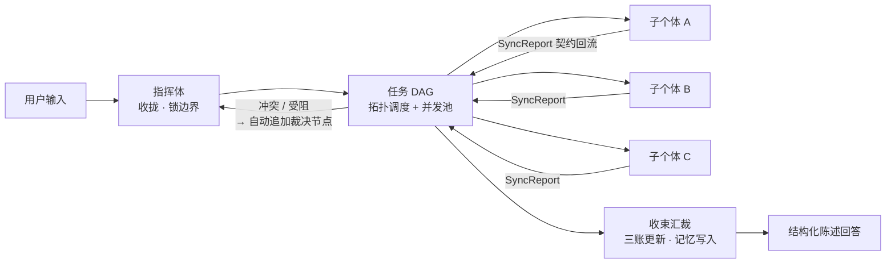

# ExMachina — 一个群体协作的智能集群

<div align="center">

```text
███████╗  ██╗  ██╗  ███╗   ███╗   █████╗    ██████╗  ██╗  ██╗  ██╗  ███╗   ██╗   █████╗
██╔════╝  ╚██╗██╔╝  ████╗ ████║  ██╔══██╗  ██╔════╝  ██║  ██║  ██║  ████╗  ██║  ██╔══██╗
█████╗     ╚███╔╝   ██╔████╔██║  ███████║  ██║       ███████║  ██║  ██╔██╗ ██║  ███████║
██╔══╝     ██╔██╗   ██║╚██╔╝██║  ██╔══██║  ██║       ██╔══██║  ██║  ██║╚██╗██║  ██╔══██║
███████╗  ██╔╝ ██╗  ██║ ╚═╝ ██║  ██║  ██║  ╚██████╗  ██║  ██║  ██║  ██║ ╚████║  ██║  ██║
╚══════╝  ╚═╝  ╚═╝  ╚═╝     ╚═╝  ╚═╝  ╚═╝   ╚═════╝  ╚═╝  ╚═╝  ╚═╝  ╚═╝  ╚═══╝  ╚═╝  ╚═╝
```


</div>

<p align="center">
  <a href="./README.md">简体中文</a> · <a href="./README_EN.md">English</a>
</p>

> [!WARNING]
> 项目处于开发阶段（pre-alpha），接口与数据格式可能破坏性变更，请勿用于生产环境。
> 契约以 [docs/](./docs) 为唯一事实源。

---

## 快速开始

前置：[Rust](https://rustup.rs)（stable）与 Node.js ≥ 22（仅构建 WebUI 需要）。

**快速启动**（下载预编译发行版，无需 Rust / Node）：

```bash
# Linux / macOS
curl -fsSL https://raw.githubusercontent.com/KurohaneKaoruko/ExMachina/main/scripts/quickstart.sh | bash
```

```batch
:: Windows
curl -fsSL -o quickstart.bat https://raw.githubusercontent.com/KurohaneKaoruko/ExMachina/main/scripts/quickstart.bat
quickstart.bat
```

从 [Releases](https://github.com/KurohaneKaoruko/ExMachina/releases) 下载预编译包，解压即用，免编译。

**从源码安装**（含 Rust/Node 安装 + 克隆 + 编译 + 构建 + 启动）：

```bash
# Linux / macOS
curl -fsSL https://raw.githubusercontent.com/KurohaneKaoruko/ExMachina/main/scripts/install.sh | bash
```

```batch
:: Windows（下载后运行）
curl -fsSL -o install.bat https://raw.githubusercontent.com/KurohaneKaoruko/ExMachina/main/scripts/install.bat
install.bat
```

脚本自动安装缺失的 Rust / Node.js，克隆仓库，编译构建，启动网关。

浏览器打开 http://127.0.0.1:4173 即可使用。首次建议到「模型提供商」页配置 API 密钥。

**手动构建**：

```bash
git clone https://github.com/KurohaneKaoruko/ExMachina.git && cd ExMachina
npm install && npm run build:webui
cargo run -p exm-gateway --release        # http://127.0.0.1:4173
```

终端对话与编成查看：

```bash
cargo run -p exm-cli --release --bin exm -- chat "分析当前项目的架构风险"
cargo run -p exm-cli --release --bin exm -- agents
```

> **低性能设备**（淘汰笔记本 / 迷你主机 / 老台式机）：到 [Releases](https://github.com/KurohaneKaoruko/ExMachina/releases)
> 下载预编译包，解压即得 `exm-gateway` + WebUI + 编成数据——免编译、免 Node、免 Docker，一个进程跑起整个集群。
>
> Docker：`docker compose up --build`（编成与状态卷持久化，详见 [docker-compose.yml](./docker-compose.yml)）。

## 为什么需要"集群"，而不是再要一个助手

单个智能体助手的天花板很清楚：**一个上下文、一串思维链、一次回答**。任务越大，
它越容易在长链条里丢约束、丢证据、自己跟自己妥协——你无法知道结论是怎么来的，
也无法在它跑偏时介入。

EXMACHINA 换了一条路：把"完成一件复杂事"拆成一个**可被审计的组织行为**。

- **有分工**——指挥体只做一件事：锁边界、拆任务、派活、裁决、收束；
  39 个子个体各守一域（研究、架构、实作、校验、决策、运维、安全、文档…），
  领到的是带边界与验收口径的 DispatchOrder，而不是一句模糊的愿望。
- **有回路**——每个子个体必须以 SyncReport 交卷：结论、证据等级、风险、阻塞、置信度。
  结构不合规就重写，证据不足就标注为推断，受阻就把解除条件带回来——**回流不是汇报，是验收**。
- **有仲裁**——两个子个体结论冲突时，不静默合并，而是动态追加裁决节点，
  让分歧显式地留在记录里。
- **有账本**——任务账、证据账、风险账随任务原子更新。任何一个结论，
  都能回答"依据是什么、风险在哪、退路是什么"。
- **有记忆**——个体记忆（私有）让每个子个体越用越顺手，群体记忆（共享）让整个集群共享经验；
  受阻教训会自动沉淀为该个体的行为改进要点。
- **有组织形态**——组是隔离与切换单位：默认组是这套智械集群，你也可以另建任意多个组，
  各自独立编成，甚至只放一个主智能体，让它自己扩编。

一句话：**别的产品给你一个更聪明的个体，EXMACHINA 给你一支能被审计、能积累、能扩张的队伍。**

## 关键优势

**集体智能（核心）**

| 能力 | 说明 |
|------|------|
| 结构化分解 | 指挥体输出 OrchestratorPlan（L0 直答 / L1 单链 / L2 并行 / L3 含裁决），节点带验收口径与依赖 |
| 并行调度 | 任务 DAG 拓扑调度 + 并发池；节点级重试、超时、受阻升级 |
| 契约回流 | SyncReport 结构与业务双校验，失败自动重写 ≤2 次，仍失败升级指挥体裁决 |
| 动态扩图 | 回流冲突/受阻时自动追加裁决节点，不静默覆盖分歧 |
| 可自由组建 | 组即隔离单位；主智能体持 `agent_manage` 工具，可在任务中按用户要求扩编组内个体 |
| 智能体 | 除组之外还可创建智能体（预置 Machina），不经调度直接服务——单体与集群共用一套记忆与模型体系 |

**记忆与进化**

| 能力 | 说明 |
|------|------|
| 分层记忆 | 群体记忆（共享：决策/证据/偏好）+ 个体记忆（私有：个体自己的教训与技巧） |
| 混合检索 | CJK 二元 + ASCII 词项倒排 × 重要性 × 时间衰减 × 类型加成，可选语义向量加成（声明 `embedModel` 即启用） |
| 双模式 | 深层记忆（默认，可检索可衰减）或文件记忆（`memory.md` 单载体、全文注入、面板直接编辑） |
| 自主压缩 | `memory.md` 超限触发 AI 压缩，被精简的原文自动归档——**nothing is lost** |
| 经验优化 | 受阻教训累计到阈值 → 提炼为个体行为改进要点（版本化、可重置、可回退） |
| 可靠性统计 | 每个个体的执行/完成/受阻/平均置信度反哺指挥体选路 |

**模型与平台**

| 能力 | 说明 |
|------|------|
| 多厂商多档案 | OpenAI 兼容 / Anthropic 原生 / Gemini 原生 / Azure OpenAI 四协议；档案并存、连通测试、热生效 |
| 逐级默认模型 | 个体 `modelHint` → 所属组 → 全局生效档案，逐级回退；不同智能体可跑不同厂商 |
| 多 Key 池 | 同发起方粘性选键（保留端点侧 KV 缓存），仅在限额类失败时前进并粘住 |
| 失败回退链 | 档案可声明 `fallback`；未产出内容前自动切换候选，失败档案 45s 冷却，链尾兜底 |
| 平台接入 | Telegram 机器人 + 通用 Webhook 入站（可桥接任意 IM）；同平台多账号，账号绑定组与工作区 |
| 自动化 | cron / 一次性定时任务 + 心跳巡检，网关常驻时到期唤醒目标组执行 |
| 第三方工具 | MCP 服务器（stdio / Streamable HTTP）以 `mcp:server:tool` 挂载，懒连接、原生 function calling、审计一致 |
| 边缘算力 | 旧设备跑 `exm worker` 接入，本地模型承接派发；离线/超时自动回落本地执行 |
| 语音与多模态 | 对话页麦克风转写（whisper 系）、消息朗读（TTS）、图片输入（按协议映射多模态内容） |

**工程与安全**

| 能力 | 说明 |
|------|------|
| 单进程交付 | 一个网关进程同时提供 REST API、WebSocket 事件流与 WebUI 静态托管 |
| 断点续跑 | 进程被杀/断电后重启自动续跑：已完成节点回流回填，非终态节点重新派发 |
| 执行闸门 | 终端命令审批（off/risky/always）+ 前缀白名单 + 审批代执行 + 工具审计落库 |
| 访问控制 | `authKey` 非空即启用 REST/WS 全量鉴权与 WebUI 登录门；通道级会话白名单 |
| 预算硬顶 | 会话 token 预算与终端超时强杀（进程树），失控循环不会拖死节点 |
| 编成即数据 | 个体 / 链路 / 技能 / 人设 / 组全是 `agents/` 下的可编辑数据，热装载，改完即生效 |
| 可替换实现 | Bus / Registry / Scheduler / 远端执行均为接口或可替换实现，单机先行、分布式不改上层 |

## 核心概念

- **交互目标**——你对话的对象：某个**智能体组**（集群协作）或某个**智能体**（单体服务）。
  切换目标即切换会话上下文，在 WebUI「对话」页左栏完成。
- **指挥体 / 子个体**——组模式下，主智能体（指挥体）收拢目标、分解 DAG、派发、裁决、收束；
  子个体在各自职责域内执行并契约回流。
- **三账**——任务账（目标/验收/约束/禁令）、证据账（A 直接验证 – D 推断）、风险账（影响/阻断/回退）。
  每次回答都可追溯依据与风险。

## 核心循环



## 架构一览

```
渠道（WebUI / CLI / Telegram / Webhook / Worker）
        │ REST / WebSocket
┌───────▼────────────────────────────────────────┐
│ exm-gateway   axum 接入层：路由 / 鉴权 / 静态托管  │
│               Telegram 监督循环 / cron / worker hub│
├────────────────────────────────────────────────┤
│ exm-core                                        │
│  Orchestrator  收拢→分解→派发→裁决→收束          │
│  Scheduler     任务 DAG 拓扑调度 + 并发池         │
│  AgentRuntime  子个体 LLM 循环 + 工具调用 + 回流   │
│  LocalRegistry 组/个体/提示词/技能/人设（热装载）  │
│  MemoryStore   分层记忆：词项+语义检索/衰减/压缩    │
│  Store         会话/消息/图/证据/事件持久化        │
│  ToolGateway   工具网关（沙箱/白名单/审批/审计/MCP）│
│  LlmProvider   四协议接入 + 档案池 + Key 池 + 回退 │
└───────┬────────────────────────────────────────┘
        │ OpenAI 兼容 / Anthropic / Gemini / Azure
     各厂商模型端点
```

- **核心语言**：Rust（并发与长驻进程关键路径）；WebUI 为 TypeScript + React 19 + antd 6。
- **提示词协议**：`agents/prompts/protocol/` 下 11 部协议（绝对理性 / 证据分级 / 冲突裁决 /
  多智能体回流 / 审查 / 调试 / 变更 / 审计 / 发布 / 回滚 / 工作区协作），编织进指挥体与子个体的系统提示。
- **存储**：文档型 fsdb（`.exmachina/data`），无 C 依赖；repository 接口保留换回 SQLite/redb 的余地。

## CLI 命令

| 命令 | 作用 |
|------|------|
| `install` | 首启安装向导（环境检查 → 模型接入 → 落盘 → 自检） |
| `doctor` | 体检：配置 / 编成 / 记忆 / 模型通道 / WebUI |
| `chat [text]` | 与当前交互目标对话（无 text 进交互模式） |
| `agents [--capability]` | 个体编成清单 |
| `tasks <sessionId>` | 会话任务图 |
| `serve [--port]` | 起网关（REST + WS + WebUI） |
| `worker --url <ws://hub:4173/worker>` | 以本机算力接入中心网关（边缘执行节点） |
| `model list/add/use/remove/test` | 提供商档案（`use` 设全局默认，热生效） |
| `group list/create/switch/info/delete/export/import` | 智能体组：组建、切换、导入导出组包 |
| `agent create/remove/set-primary` | 组内个体管理（首个个体自动成为主智能体） |
| `agent optimize/adaptation/reset-adaptation` | 经验优化：教训提炼为个体行为改进要点 |
| `persona get/set/reset` | 人设（说话风格）编辑 |
| `skill list/add/remove` | 技能包（任务目标命中触发词即随派发携带） |
| `cron list/add/run/enable/disable/remove/runs` | 定时任务（网关常驻时自动调度） |
| `approval list/approve/deny` | 终端命令审批（高危命令拦截与决定） |
| `memory list/search/add/pin/forget/reindex/decay/render/stats` | 分层记忆系统 |
| `config list/get/set/schema` | 配置管理（schema 同时驱动 WebUI 设置页） |

`exm` 与 `exmachina` 可互换；全局参数 `--workspace <dir>` 指定工作区。

## 配置与模型

唯一配置事实源 `.exmachina/config.json`（CLI / 网关 / WebUI 三端共用，环境变量 `EXM_*` 优先级最高），
改完即热生效，无需重启。

```bash
exm model add deepseek --name "DeepSeek 主力" \
  --base-url https://api.deepseek.com/v1 --api-key sk-... \
  --orch-model deepseek-chat --unit-model deepseek-chat
exm model use deepseek      # 设为全局默认
exm model test deepseek     # 连通测试（真实发一条极短请求）
```

- **逐级默认模型**：个体 `modelHint` → 所属组 `model` → 全局生效档案；提示格式 `档案ID` 或 `档案ID/模型名`。
- **多 Key 池**：档案内多把 Key 粘性负载，仅限额类失败时切换；**失败回退链**由 `fallback` 声明。
- **未配置模型时**：系统不会用任何"模拟输出"顶上——CLI 与 WebUI 会明确说明"模型通道未配置"并指向「提供商」页。

## 智能体组

- **组即隔离**：会话、任务图、工作区、编成按组隔离；组是切换与对外服务的完整单元。
- **主智能体**：直接对接用户，持 `agent_manage` 工具，可在任务中创建/修改组内子个体（仅自定义组）。
- **组工作区**：每组可指定相对子目录作为该组个体文件与命令的操作根，组间文件互不可见。
- **组包**：`exm group export / import` 把一整套组编成（元信息 + 个体定义 + 提示词）导出成分发文件。

```bash
exm group create 研发组 --id dev --description "需求拆解与实现"
exm agent create 主脑 --identifier chief --description "组内主智能体" --tier orchestrator
exm group switch company
```

## 记忆系统

群体记忆（共享）+ 个体记忆（私有）；派发注入「该个体私有 + 群体共享」，指挥体规划只注入群体记忆。

```bash
exm memory search "架构 风险"                                     # 检索全部（显示得分与理由）
exm memory search "入口 侦察" --agent scout-agent                 # 某个体可见范围
exm memory add --kind fact "构建入口" "cargo build --release" --pin          # 群体共享
exm memory add --kind fact "常用探针" "curl /api/health" --agent machina     # 某个体私有
exm memory stats                                                  # 群体/个体统计 + 个体可靠性
exm memory decay && exm memory reindex                            # 衰减整理 + 重建索引
```

每次任务自动写入：会话摘要、边界决策、A/B 级证据（群体）、受阻教训（归属个体）。
`memory.md` 是人读的基础记忆视图；`memory.enabled=false` 时切换为**文件记忆模式**——
`memory.md` 成为唯一记忆载体，全文注入每轮规划，面板可直接编辑。

## 人设与经验优化

```bash
exm persona get context-agent                        # 查看人设（标注 默认/自定义）
exm persona set context-agent --text "以武侠风格说话，简洁而有侠气。"
exm persona reset context-agent                      # 恢复默认智械体风格

exm agent adaptation <identifier>                    # 查看该个体的行为改进要点
exm agent reset-adaptation <identifier>              # 重置
```

人设只影响说话风格、不影响职责，保存在 `agents/personas/<identifier>.md`，下一次派发即生效。
行为改进要点由受阻教训提炼而来（版本化、可回退），注入后续派发——**只调优，不创建**。

## WebUI 控制台

网关单进程托管，侧栏 14 个面板 + 5 套强调色主题：

| 面板 | 用途 |
|------|------|
| 对话 [CHAT] | 主交互面：切换交互目标（组 / 智能体）、实时流式输出、任务时间线、语音输入与朗读 |
| 智能体 / 智能体组 | 智能体与组的管理：编成、主智能体、组工作区、默认模型 |
| 个体 [UNITS] | 激活组编成清单、人设可视化编辑、经验优化 |
| 提供商 [PROVIDERS] | 端点与密钥唯一下发处：多档案、Key 池、连通测试、全局默认 |
| 任务图 [DAG] / 三账 [LEDGER] | 任务 DAG 可视化 / 任务账·证据账·风险账 |
| 记忆 [MEMORY] / 事件 [EVENTS] | 记忆检索与治理 / 事件溯源回放 |
| 技能 / 自动化 / 审批 / 通道 | 技能包、定时任务、命令审批、Telegram 与 Webhook 通道 |
| 设置 [CONFIG] | 运行时 / 记忆 / 安全 / 自动化（schema 驱动） |

## 验证

```bash
cargo check --workspace                 # 编译检查
cargo test --workspace                  # 单测 + 端到端冒烟（编成契约 / 建组切换 / 全链路 / 默认模型 / 审批）
cargo run -p exm-gateway --example e2e  # 网关端到端验收（REST 全端点 / 事件流 / 三账 / 记忆 / 组）
npm run build:webui                     # WebUI 构建（tsc + vite）
```

测试使用确定性测试替身（`EXM_LLM_MOCK=1`），不依赖真实模型与网络；真实端点联调用 `exm model test`。

## 文档

| 文档 | 内容 |
|------|------|
| [docs/安装指南.md](./docs/安装指南.md) | 环境要求、安装步骤、提供商与密钥配置、访问密钥、Docker |
| [docs/使用指南.md](./docs/使用指南.md) | CLI 全命令与 WebUI 全面板手册、典型工作流 |
| [docs/架构与设计.md](./docs/架构与设计.md) | 设计理念、分层架构、核心机制（调度 / 契约回流 / 三账 / 记忆 / 模型解析） |
| [docs/协议与契约.md](./docs/协议与契约.md) | 语言规范、核心实体 schema、编排契约、REST/WS API、存储布局、扩展点 |

---

> [!NOTE]
> README 同样遵守 EXMACHINA 的语言纪律：能力描述以**已实现的契约**为准，
> 未竟事项在 docs/ 各卷明确标注，不写入"即将支持"式承诺。